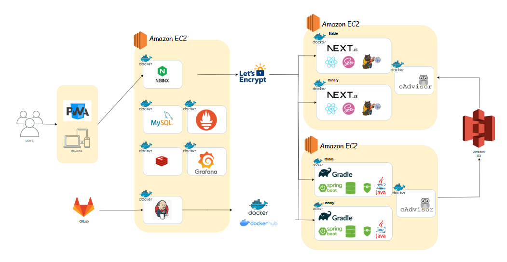

# 목차

[서비스](#-서비스)  
[팀원](#-팀원)  
[화면](#-화면)  
[문서](#-문서)  

# 🐕 서비스

<aside>
💡 [투명한 후원 내역 공개와 간편한 기부로 활발하고 건강한 기부 문화를 만들어가는 유기견 후원 서비스]
</aside>

# 👨‍👩‍👦‍👦 팀원

<table>
 <th>BackEnd</th>
 <tr>
    <td align="center"></a></td>
    <td align="center"></a></td>
  </tr>
  <tr> 
    <td align="center">유승호</td>
    <td align="center">장인영</td>
  </tr> 
</table>
<table>
 <th>Infra</th>
 <tr>
    <td align="center"></a></td>
  </tr>
  <tr> 
    <td align="center">이대현</td>
  </tr> 
</table>
<table>
 <th>FrontEnd</th>
 <tr>
     <td align="center"></a></td>
    <td align="center"></td>
    <td align="center"></td>
    
  </tr>
  <tr> 
    <td align="center">황연주</td>
    <td align="center">최윤지</td>
    <td align="center">김미나</td>
  </tr> 
</table>

# 🛠️ 기술 스택

<table>
<th>BackEnd</th>
</table>

<table>
<th>FrontEnd</th>
</table>

  

<table>
<th>Infra</th>
</table>

  

 

  

  

<table>
<th>Tool</th>
</table>

 

# 💻 화면

## 0. 메인 화면 및 로그인 화면

### 메인화면

## 1. 단체 보기

## 2. 후원하기

## 3. 마이페이지

## 5. 관리자 화면

### 단체 정보 관리

### 후원금 관리

### 강아지 관리

# 📕 문서

### 플로우차트

[플로우차트](https://www.figma.com/board/Ey1gf3Ka0pYfiExzvZlYWw/IA?node-id=0-1&t=bEs3e8rKoYlCuEpD-1)

### 기능 명세서

[기능명세서](https://polarized-flier-75a.notion.site/1a5abd8c56488080bd81cdece036d72d?pvs=4)

### API 문서

[API 문서](https://polarized-flier-75a.notion.site/Api-1a4abd8c56488052a8d2d2ecbf9d9d44?pvs=4)

### ERD

[ERD 문서](https://dbdiagram.io/d/%ED%8A%B9%ED%99%94%ED%94%84%EB%A1%9C%EC%A0%9D%ED%8A%B8-67bd0b4b263d6cf9a0507acd)

### 아키텍쳐

